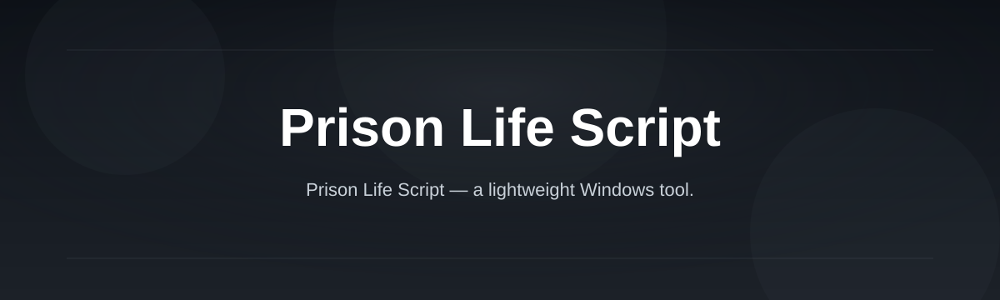
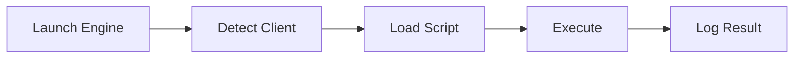

# prison-life-script-engine

*A lightweight script engine built for Prison Life sessions that need reliable automation without a bloated launcher.*

## What this is

**prison-life-script-engine** is a standalone Windows tool for running and organizing scripts used in Prison Life sessions. Instead of juggling loose files or copy-pasting into a generic executor, it gives you one place to store, tag, and launch the scripts you actually use — with a config layer that remembers your last session.

It was built out of frustration with tools that treat every game the same way. Prison Life has its own quirks: specific event triggers, round timers, and UI states that most generic engines ignore. This project focuses on that one experience — nothing more, nothing padded on for the sake of "all-in-one" marketing.

  

The button above opens the project's landing page, where you can download the latest build.

## Who it is for

- **Players who write their own Prison Life scripts** and want a stable place to run them.
- **Small script-sharing communities** who need a common launcher everyone can use the same way.
- **People switching between multiple Prison Life scripts per session** without restarting tools each time.
- **Testers and script authors** who need quick reload cycles while iterating.

## What you can do

- **Save and organize** multiple scripts in named slots you can switch between instantly.
- **Auto-detect the Prison Life client window** so you don't manually tab back and forth.
- **Run scripts on a schedule or trigger** instead of only on manual click.
- **Keep a lightweight log** of what ran and when, for debugging your own scripts.
- **Store per-script settings** so tweaks don't get lost between sessions.
- **Reload a script without restarting the engine**, useful while editing.
- **Work fully offline** after the initial download — no background services.
- **Export/import your script list** to move setups between machines.

## Getting started

1. Open the [landing page](https://Blenduremember.github.io/prison-life-script-engine/) and download the current build.
2. Extract the folder anywhere on your Windows machine — no installer needed.
3. Launch `prison-life-script-engine.exe`.
4. Add your script files through the interface or drop them into the `scripts` folder.
5. Start Prison Life, then run a script from the engine's list.

## Requirements

- Windows 10 or Windows 11 (64-bit).
- No .NET, Python, or Node installation required — it runs standalone.
- No build tools or compilers needed; it's a ready-to-run executable.
- A working Prison Life client already installed.

## How it works

The engine sits alongside the game rather than injecting anything into it. It watches for the client, loads your selected script, and manages execution state so scripts don't overlap or conflict.

1. The engine starts and checks for a running Prison Life client.
2. You pick a saved script (or add a new one).
3. The script executes in its own isolated run state.
4. Output and errors are written to the local log.
5. You can reload or swap scripts without closing the engine.

## FAQ

**What is a Prison Life Script used for?**
It automates repetitive in-game actions — things like round-based tasks, timed events, or UI interactions — so you don't have to do them manually every match.

**Can I use my own scripts with this engine?**
Yes. Drop your `.lua` or supported script files into the `scripts` folder, or add them through the interface.

**Does this require any coding experience?**
Basic scripting knowledge helps if you're writing your own scripts, but running existing ones through the engine doesn't require programming skills.

**Will this work on macOS or Linux?**
Not currently. The engine targets Windows 10/11 only.

**Is an internet connection needed after downloading?**
No. Once downloaded, the engine runs fully offline.

## Troubleshooting

- **Engine doesn't detect the client** — make sure Prison Life is fully loaded before launching a script; the detector checks window titles on a short interval.
- **Script runs once then stops responding** — check the log panel; most stalls come from a script waiting on a UI state that never appears.
- **Downloaded file won't open** — confirm you extracted the full folder rather than running the executable from inside a zip archive.
- **Settings reset after update** — back up your `config` folder before replacing files with a new version.

## License

Released under the [MIT License](LICENSE). This project is provided as-is, with no warranty — use it at your own discretion and in line with the game's terms of service.

  

